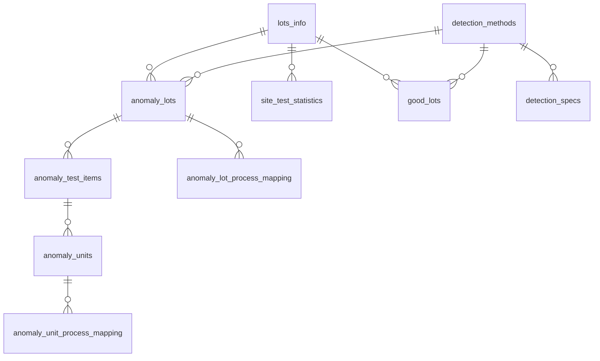

# Dapper .NET Framework 4.6.1 Console + MySQL 範本

> 給 .NET Framework 4.6.1 Console 專案使用的 Dapper + MySQL 基底。  
> 目標是讓新工程師拿到後能直接看懂、直接改、直接延伸。

## 專案定位

這個專案只處理兩件事：

1. 在 Console 模式下讀寫 MySQL。
2. 提供可延伸到正式環境的資料存取範本。

這份 codebase 的重點不是抽象層數量，而是：

- SQL 明確、可追蹤、好除錯
- Repository 邊界清楚，但不過度包裝 Dapper
- 預設避開容易被複製成效能瓶頸的查詢模式
- 跨 Repository 的邏輯集中在 Service
- README 與實際程式碼結構一致

## 技術棧

| 類別 | 內容 |
|------|------|
| Runtime | .NET Framework 4.6.1 |
| ORM | Dapper 2.1.35 |
| MySQL Driver | MySql.Data 6.10.9 |
| Logging | NLog 5.3.4 |
| Statistics | MathNet.Numerics 5.0.0 |

## 快速開始

本專案使用**傳統（非 SDK-style）.csproj** 格式搭配 `packages.config`，需在 Windows 環境下以 Visual Studio 或 MSBuild 建置。

### 使用 Visual Studio

1. 以 Visual Studio 2017（15.0）以上版本開啟 `dapper_best_practice_net46.sln`
2. NuGet 套件會在開啟方案時自動還原（或手動執行「還原 NuGet 套件」）
3. 按 <kbd>F5</kbd> 或 <kbd>Ctrl</kbd>+<kbd>F5</kbd> 執行

### 使用命令列（需安裝 Visual Studio 或 Build Tools）

```bash
# 還原 NuGet 套件（packages/ 目錄）
nuget restore dapper_best_practice_net46.sln

# 建置
msbuild dapper_best_practice_net46.sln /p:Configuration=Debug

# 擇一設定連線字串
set MYSQL_CONNECTION_STRING=Server=localhost;Database=app_db;Uid=root;Pwd=your_password;

# 執行（啟動檢查 + 資料存取示範）
DapperMySqlCrudExample\bin\Debug\DapperMySqlCrudExample.exe
```

> 本專案使用 `MySql.Data 6.10.9`，為純 managed assembly、無間接依賴，在 net461 + VS2017 下可直接編譯，不需額外的警告抑制設定。  
> **注意**：傳統 .csproj 格式不支援 `dotnet build` / `dotnet run`，請使用 MSBuild 或 Visual Studio 建置。

## 目前結構

```text
dapper_best_practice_net46.sln
└── DapperMySqlCrudExample/
    ├── Program.cs
    ├── App.config
    ├── NLog.config
    ├── Infrastructure/
    │   └── DbConnectionFactory.cs
    ├── Models/
    │   ├── AnomalyLot.cs
    │   ├── AnomalyLotProcessMapping.cs
    │   ├── AnomalyTestItem.cs
    │   ├── AnomalyUnit.cs
    │   ├── AnomalyUnitProcessMapping.cs
    │   ├── DetectionMethod.cs
    │   ├── DetectionSpec.cs
    │   ├── GoodLot.cs
    │   ├── SiteTestStatistic.cs
    │   └── QueryModels/
    │       ├── SiteMeanCalcParams.cs
    │       └── SiteMeanRow.cs
    ├── Repositories/
    │   ├── AnomalyLotProcessMappingRepository.cs
    │   ├── AnomalyLotRepository.cs
    │   ├── AnomalyTestItemRepository.cs
    │   ├── AnomalyUnitProcessMappingRepository.cs
    │   ├── AnomalyUnitRepository.cs
    │   ├── DetectionMethodRepository.cs
    │   ├── DetectionSpecRepository.cs
    │   ├── GoodLotRepository.cs
    │   └── SiteTestStatisticRepository.cs
    ├── Services/
    │   └── DetectionSpecService.cs
    ├── Samples/
    │   └── CrudSampleRunner.cs
    └── Sql/
        ├── schema.sql
        ├── schema-legacy.sql
        └── sample-data.sql
```

## 執行流程

執行時會依序進行：

1. 建立 `DbConnectionFactory` 並驗證資料庫連線（`SELECT 1`）
2. 執行 [CrudSampleRunner.cs](DapperMySqlCrudExample/Samples/CrudSampleRunner.cs) 中的示範流程：
   - 不使用交易的基本 CRUD
   - 同一交易中的 Commit / Rollback
   - `DetectionSpecService` 的 SITE_MEAN 計算範例

> ⚠️ **注意**：執行時會對連線的資料庫執行實際的 INSERT / UPDATE / DELETE，請勿對正式環境資料庫執行。

Sample 只是教學入口，不應直接視為正式工作流程實作。

## 核心設計原則

### 1. 連線短生命週期

[DbConnectionFactory.cs](DapperMySqlCrudExample/Infrastructure/DbConnectionFactory.cs) 每次 `Create()` 都回傳新的**尚未開啟**的連線，呼叫端以 `using` 管理生命週期。

Dapper 的 `Query`、`Execute`、`ExecuteScalar` 等方法內建自動開關連線的邏輯：傳入未開啟的連線時，Dapper 會自動 Open → 執行 SQL → Close，連線只在 SQL 執行期間被佔用，持有時間最短。需要交易時，必須在 `BeginTransaction()` 前手動呼叫 `conn.Open()`。

這個專案不引入額外的 connection wrapper 或 Unit of Work。

### 2. Repository 只保留有意義的查詢

此範本刻意不把下列方法當成所有 Repository 的預設介面：

- `GetAll()`
- offset 分頁的 `GetPaged(offset, limit)`

原因很單純：

- `GetAll()` 很容易被拿去掃整張大表
- offset 分頁在資料量大時會變慢
- 新工程師會複製模板，所以模板預設本身就要保守

唯一保留的例外是 [DetectionMethodRepository.cs](DapperMySqlCrudExample/Repositories/DetectionMethodRepository.cs)，因為 `detection_methods` 屬於低筆數、穩定的 lookup / master table，保留 `GetAll()` 與 `GetCount()` 能幫助新工程師快速理解最基本的 Dapper 查詢寫法。

目前 Repository 保留的查詢模式以這幾類為主：

- 小型主檔表的 `GetAll()` 與 `GetCount()`，僅限 `DetectionMethodRepository`
- `GetById`
- `Exists`
- 依外鍵或業務條件查詢，例如 `GetByLotsInfoId`、`GetByKey`

### 3. `method_key` 是程式用識別值

`detection_methods` 的欄位語意如下：

- `id`: 資料庫主鍵，其他表用 FK 參照
- `method_key`: 穩定的程式識別值，例如 `YIELD`、`SITE_MEAN`
- `method_name`: 給人讀的顯示名稱，例如 `良率偵測`

其他表請一律用 `detection_method_id` 關聯到 `detection_methods.id`。  
不要用 `method_name` 做 FK，也不要把顯示名稱當程式判斷依據。

### 4. 跨 Repository 邏輯放在 Service

[DetectionSpecService.cs](DapperMySqlCrudExample/Services/DetectionSpecService.cs) 負責：

- 讀取 `site_test_statistics`
- 用 MathNet.Numerics 計算平均值與標準差
- 推導 UCL / LCL
- 寫入 `detection_specs`

Repository 保持單一職責：

- 寫明確 SQL
- 不做統計運算
- 不封裝跨表工作流程

Service 中的交易由 `using` 區塊管理。當 `tx.Commit()` 未被呼叫而離開 `using` 範圍時（包含例外），`MySqlTransaction.Dispose()` 會自動執行 Rollback，無需顯式 try/catch。這是 ADO.NET 的標準行為，同樣適用於 `DbTransaction` 的所有實作。

### 5. SITE_MEAN 取樣策略已做固定上限

[SiteTestStatisticRepository.cs](DapperMySqlCrudExample/Repositories/SiteTestStatisticRepository.cs) 的 `QuerySiteMeanRows()` 策略為取最新 30 筆有效資料（`mean_value IS NOT NULL` 且 `start_time IS NOT NULL`），以單一查詢完成。

若近期資料充足，結果自然全為近期；若不足則涵蓋更早的歷史。

`DetectionSpecService` 設定 `MinimumSampleCount = 2`：樣本不足兩筆時直接拋出例外，不嘗試計算。當只有一筆資料時標準差為 0，會導致 UCL = LCL = mean，過度敏感而產生誤報。

這樣做的目的：

- 避免一次把整個月的資料全部撈進記憶體
- 讓查詢筆數上限固定，只需一次 DB round-trip
- 搭配 `(program, site_id, test_item_name, start_time)` 索引更容易吃到效能優勢

## 交易（Transaction）使用指南

### 判斷原則：什麼時候該用交易？

| 情境 | 是否需要交易 | 原因 |
|------|:----------:|------|
| 單一 SELECT 查詢 | 否 | 單一 SQL 語句本身就是原子操作 |
| 單一 INSERT / UPDATE / DELETE | 否 | 單一寫入不涉及多步驟一致性 |
| 多筆寫入必須全成功或全失敗 | **是** | 避免部分寫入成功、部分失敗的髒資料 |
| 先讀取再根據結果寫入 | **是** | 避免讀取與寫入之間資料被其他連線異動 |
| 跨多個 Repository 的業務流程 | **是** | 確保跨表操作的資料一致性 |

簡單判斷法：**如果操作拆成兩半，前半成功後半失敗會造成資料不一致，就該用交易。**

### 情境一：不需要交易 — 單一操作

大多數 Repository 的讀取與獨立寫入方法都不需要交易，每次操作自行開關連線即可。

```csharp
// Repository 內部：無交易時自行建立短生命週期連線
public DetectionMethod GetById(byte id)
{
    const string sql = "SELECT ... FROM detection_methods WHERE id = @Id";
    using (var conn = _factory.Create())
    {
        return conn.QueryFirstOrDefault<DetectionMethod>(sql, new { Id = id });
    }
}
```

**本專案所有 Repository 的 `GetById`、`GetByXxx`、`Exists` 方法都走這個模式。**

設計原因：

- 單一 SELECT 不需要跨語句一致性保證
- 短連線用完即歸還連線池，減少資源佔用
- 程式碼最簡潔，不需額外管理交易物件

同理，單筆 Insert 若不需要與其他操作綁定，也不用交易：

```csharp
// 不傳 transaction 參數 → Repository 內部自建連線
repo.Insert(newMethod);
```

> 對應程式碼：[CrudSampleRunner.cs](DapperMySqlCrudExample/Samples/CrudSampleRunner.cs) 範例一

### 情境二：需要交易 — 多筆寫入的原子性

當多個寫入操作必須全部成功或全部撤銷時，需要交易。

```csharp
using (var conn = connectionFactory.Create())
{
    conn.Open();  // 交易前必須明確開啟
    using (var tx = conn.BeginTransaction())
    {
        // 兩筆 Insert 共用同一條連線與交易
        byte idA1 = repo.Insert(methodA1, tx);
        byte idA2 = repo.Insert(methodA2, tx);

        tx.Commit(); // 全部成功才寫入
    }
}
// 若 Commit() 之前發生例外，using 區塊結束時 tx.Dispose() 自動 Rollback
```

> 對應程式碼：[CrudSampleRunner.cs](DapperMySqlCrudExample/Samples/CrudSampleRunner.cs) 範例二 (A) Commit 場景

設計原因：

- 兩筆 Insert 代表一個業務單元（例如同時建立偵測方法與其關聯設定）
- 若第二筆失敗但第一筆已寫入，資料庫會出現孤立記錄
- 交易確保「全有或全無」（all-or-nothing）

### 情境三：需要交易 — 顯式 Rollback

當需要在 catch 區塊中執行額外清理邏輯時，使用顯式 Rollback：

```csharp
using (var conn = connectionFactory.Create())
{
    conn.Open();  // 交易前必須明確開啟
    using (var tx = conn.BeginTransaction())
    {
        try
        {
            byte idB = repo.Insert(methodB, tx);

            // 模擬業務邏輯錯誤
            throw new InvalidOperationException("模擬業務錯誤，強制 Rollback。");
        }
        catch (InvalidOperationException ex)
        {
            tx.Rollback(); // 顯式撤銷
            _logger.Warn(ex, "Rollback 完成");
        }
    }
}
```

> 對應程式碼：[CrudSampleRunner.cs](DapperMySqlCrudExample/Samples/CrudSampleRunner.cs) 範例二 (B) Rollback 場景

**兩種 Rollback 方式的差異：**

| 方式 | 做法 | 適用場景 |
|------|------|---------|
| 隱式 Rollback | 不呼叫 `Commit()`，讓 `using` 結束時 `Dispose()` 自動 Rollback | 例外直接往上拋，不需額外處理 |
| 顯式 Rollback | 在 `catch` 中呼叫 `tx.Rollback()` | 需要在 Rollback 後記錄日誌、通知或執行補償邏輯 |

兩者效果相同，選擇取決於是否需要在 Rollback 後做額外事情。

### 情境四：需要交易 — 讀取→計算→寫入的一致性

這是本專案最複雜的交易場景，出現在 [DetectionSpecService.cs](DapperMySqlCrudExample/Services/DetectionSpecService.cs) 的 SITE_MEAN 規格計算：

```csharp
using (var conn = _factory.Create())
{
    conn.Open();  // 交易前必須明確開啟
    using (var tx = conn.BeginTransaction(IsolationLevel.RepeatableRead))
    {
        // 步驟 1：在交易中讀取 30 筆歷史統計資料
        var rows = _siteTestStatRepo.QuerySiteMeanRows(programName, siteId, testItemName, tx);

        // 步驟 2：記憶體內計算平均值、標準差、管制上下限
        var (mean, std) = CalculateMeanAndStd(rows);
        var (ucl, lcl) = CalculateControlLimits(mean, std);

        // 步驟 3：查詢 SITE_MEAN 的 detection_method_id（同一交易內）
        byte methodId = GetRequiredSiteMeanMethodId(tx);

        // 步驟 4：將計算結果寫入 detection_specs
        long newId = _detectionSpecRepo.Insert(spec, tx);

        tx.Commit();
        return newId;
    }
}
```

**為什麼這裡必須使用 `RepeatableRead` 隔離層級？**

```
時間軸         交易 A（本計算）           交易 B（外部寫入）
  t1     讀取 30 筆歷史資料
  t2                                   修改了其中 5 筆資料 ← 問題！
  t3     根據 t1 的資料計算 UCL/LCL
  t4     寫入計算結果
```

若不使用 `RepeatableRead`：交易 B 在 t2 修改的資料會導致 t3 的計算基礎與實際資料不一致，寫入的規格值可能是錯的。

`RepeatableRead` 保證：**t1 讀取的 30 筆資料在整個交易期間不會被其他交易修改**，確保「讀取→計算→寫入」三步驟基於一致的資料快照。

### Repository 的交易參數設計模式

所有 Repository 的寫入方法都遵循相同的 optional transaction 模式：

```csharp
public byte Insert(DetectionMethod entity, IDbTransaction transaction = null)
{
    const string insertSql = "INSERT INTO ... VALUES (...)";
    const string identitySql = "SELECT LAST_INSERT_ID()";

    // 有交易：複用交易綁定的連線（由外部 Service 管理生命週期）
    if (transaction != null)
    {
        transaction.Connection.Execute(insertSql, entity, transaction);
        return transaction.Connection.ExecuteScalar<byte>(identitySql, transaction: transaction);
    }

    // 無交易：自行建立短生命週期連線
    using (var conn = _factory.Create())
    {
        conn.Execute(insertSql, entity);
        return conn.ExecuteScalar<byte>(identitySql);
    }
}
```

**為什麼用 `IDbTransaction transaction = null` 而不是多載？**

- 同一個方法可彈性用於有交易與無交易兩種場景
- 呼叫端不傳 `transaction` 時走獨立連線，傳入時共用交易連線
- 避免維護兩份幾乎相同的多載方法

### 讀取方法是否要接受交易參數？

**預設不需要。** 大多數讀取方法（`GetById`、`GetByXxx`、`Exists`）都不接受交易參數。

**例外情況：** 當讀取操作必須參與交易以確保一致性時才加上：

| 方法 | 為什麼需要交易參數 |
|------|-------------------|
| [`DetectionMethodRepository.GetIdByKey()`](DapperMySqlCrudExample/Repositories/DetectionMethodRepository.cs) | 在 RepeatableRead 交易中查詢 `SITE_MEAN` 的 method_id，確保與同一交易中的寫入一致 |
| [`SiteTestStatisticRepository.QuerySiteMeanRows()`](DapperMySqlCrudExample/Repositories/SiteTestStatisticRepository.cs) | 在 RepeatableRead 交易中讀取歷史統計資料，確保計算基礎不被外部異動 |

判斷標準：**這個讀取結果會不會直接影響同一交易中的後續寫入？** 會 → 加交易參數；不會 → 不加。

### 交易使用的注意事項

1. **交易由 Service 層管理，Repository 層不建立交易。** Repository 只負責接受或不接受交易參數，不決定何時開始或結束交易。

2. **連線與交易的 `using` 順序很重要。** 先 `using conn`，再 `conn.Open()`，再 `using tx`。離開時反序 Dispose：先 Rollback 未 Commit 的交易，再歸還連線。

3. **交易內的所有操作必須使用 `transaction.Connection`。** 不可在交易進行中另開新連線，否則新連線不屬於該交易。

4. **隔離層級根據業務需求選擇。** 預設 `ReadCommitted` 足以應付多數場景；需要讀取一致性（如統計計算）時才升級為 `RepeatableRead`。

## Schema 重點

[schema.sql](DapperMySqlCrudExample/Sql/schema.sql) 包含 9 張核心表；[schema-legacy.sql](DapperMySqlCrudExample/Sql/schema-legacy.sql) 提供 `lots_info` 相依表。

### 資料表關聯圖



> `lots_info` 來自 schema-legacy.sql（既有系統），其餘 9 張表由 schema.sql 定義。
> 所有 FK 均設定 `ON DELETE CASCADE ON UPDATE CASCADE`。

### 重要索引

- `site_test_statistics(program, site_id, test_item_name, start_time)` — SITE_MEAN 查詢的核心覆蓋索引
- `site_test_statistics(start_time)` — 取最新樣本排序用
- `detection_specs(program, detection_method_id)` — 規格查詢
- `detection_specs(program, test_item_name, detection_method_id)` — 含測項的規格查詢
- `detection_methods.method_key` 的唯一約束

> **索引精簡原則**：僅保留目前 Repository 查詢實際命中的索引。各表的外鍵欄位由 InnoDB 自動建立隱式索引，不另外手動建立。若未來新增查詢需要新索引，請參考 `schema.sql` 底部的「常見擴充索引」註解區塊，在對應的 Repository 方法旁加註。

### 半導體封測場景索引設計建議

以下索引建議基於半導體後段封測（OSAT）常見查詢模式，依實際 Repository 查詢需求再啟用：

| 資料表 | 建議索引 | 對應查詢場景 |
|--------|---------|-------------|
| `anomaly_lots` | `idx_created_at (created_at)` | 依時間區間查詢近期異常批次（日報 / 週報） |
| `anomaly_test_items` | `idx_test_item_name (test_item_name)` | 跨批號搜尋特定測項（如 IDD_STANDBY）的異常記錄 |
| `anomaly_units` | `idx_unit (unit_id)` | 依 Unit ID 反查追溯（顆粒級不良分析） |
| `anomaly_lot_process_mapping` | `idx_machine (machine_id)` | 依機台 ID 篩選，用於特定機台的異常批次關聯分析 |
| `anomaly_lot_process_mapping` | `idx_plant_station (plant_name, station_name)` | 依廠區 + 站點篩選異常批號（製程站點根因分析） |
| `anomaly_unit_process_mapping` | `idx_wafer_barcode (wafer_barcode)` | 依晶圓條碼追溯所有 Unit（Wafer Map 分析） |
| `anomaly_unit_process_mapping` | `idx_boat_position (boat_id, boat_x, boat_y)` | Boat Map 分析：查詢特定載具位置的 Unit |
| `anomaly_unit_process_mapping` | `idx_plant_station (plant_name, station_name)` | 依廠區 + 站點篩選，用於製程異常根因分析 |
| `anomaly_unit_process_mapping` | `idx_station_equipment (station_name, equipment_id)` | 機台異常關聯分析（特定站點 + 機台的異常聚集） |
| `site_test_statistics` | 已內建 `idx_program_site_item_time` | SITE_MEAN 規格計算核心查詢（覆蓋索引） |

> **設計原則**：
> 1. **UNIQUE INDEX 優先**：`unq_lot_method`、`unq_lot_item`、`unq_item_unit`、`unq_lot_site_item` 已涵蓋最常見的 upsert / 重複檢查場景。
> 2. **FK 隱式索引**：InnoDB 對 FK 欄位自動建立索引，不需手動重複建立（如 `anomaly_lot_id`、`anomaly_test_item_id`）。
> 3. **延遲建立**：上表索引僅在實作對應 Repository 查詢方法時才加入 schema.sql，避免寫入熱點表上的索引維護開銷。

### 若既有資料庫仍是 `method_code`

若不是新建資料庫，而是從舊版欄位升級，請先執行：

```sql
ALTER TABLE detection_methods
  CHANGE COLUMN method_code method_key VARCHAR(20) NOT NULL;
```

## 新增一張資料表時的做法

請照這個順序：

1. 在 [schema.sql](DapperMySqlCrudExample/Sql/schema.sql) 補 DDL 與必要索引
2. 在 `Models/` 新增對應 Entity
3. 若查詢只回傳部分欄位或聚合結果，放在 `Models/QueryModels/`
4. 在 `Repositories/` 新增 Repository，只實作真正需要的查詢
5. 若流程跨多個 Repository，再新增 `Services/` 類別協調

> 📄 完整的程式碼範本與慣例規則請參閱 [`.github/copilot-instructions.md`](.github/copilot-instructions.md)。

### Repository 實作原則

- 使用參數化查詢
- `Insert` 先 `Execute` 再於同一連線 `ExecuteScalar` 取 `SELECT LAST_INSERT_ID()`
- 有 transaction 時複用 `transaction.Connection`
- 無 transaction 時自行建立短生命週期連線
- 不預設提供全表掃描與 offset 分頁
- 多筆查詢方法加 `ORDER BY id`，確保結果順序可預測
- 多筆查詢回傳 `IReadOnlyList<T>`（搭配 `.ToList()`），避免 Dapper 延遲列舉在連線關閉後才存取

## 連線設定

連線字串讀取順序：

1. 環境變數 `MYSQL_CONNECTION_STRING`
2. `App.config` 的 `DefaultConnection`

正式環境建議用環境變數或祕密管理工具，不要把帳密寫死在設定檔。

## 日誌設定

[NLog.config](DapperMySqlCrudExample/NLog.config) 定義兩個輸出目標：

| 目標 | 等級 | 說明 |
|------|------|------|
| Console | Info 以上 | 開發時即時檢視 |
| File | Warn 以上 | `logs/` 目錄下每日輪替，保留 30 天 |

程式碼中使用 `NLog.LogManager.GetCurrentClassLogger()` 取得 logger，不引入額外抽象。

## 目前 solution 現況

這份 solution 目前只有主 Console 專案，尚未內建 automated test project。

如果你要把這份範本正式複製成新專案，建議下一步優先補：

- `Services` 的單元測試
- 關鍵查詢行為的整合測試

## 驗證清單

- [ ] `MYSQL_CONNECTION_STRING` 或 `DefaultConnection` 已正確設定
- [ ] `schema-legacy.sql` 與 `schema.sql` 已依順序套用
- [ ] `detection_methods` 種子資料已存在：`YIELD`、`SITE_STD`、`MEAN`、`SITE_MEAN`
- [ ] `nuget restore dapper_best_practice_net46.sln` 成功
- [ ] `msbuild dapper_best_practice_net46.sln` 成功
- [ ] `DapperMySqlCrudExample\bin\Debug\DapperMySqlCrudExample.exe` 可成功連線

## 設計決策備忘

### 為什麼全部使用同步 API

本專案刻意不使用 `async/await`：

- 目標是 .NET Framework 4.6.1 Console 應用程式，所有操作為循序執行
- `MySql.Data` 6.x 的非同步方法為同步包裝，使用 async 無實質效能增益
- 移除 async 後程式碼更短、堆疊追蹤更清楚、新工程師更容易理解
- 若未來需要遷移至 ASP.NET Core 或 .NET 8+，屆時再將 Repository / Service 方法改為 async 即可
