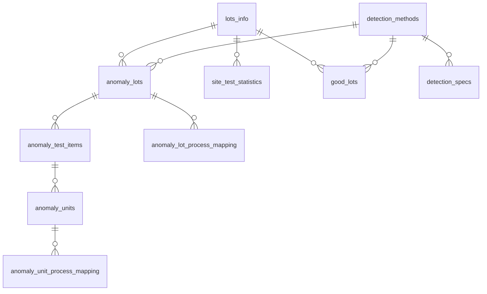

# Dapper .NET Framework 4.6.1 Console + MySQL 範本

> 給 .NET Framework 4.6.1 Console 專案使用的 Dapper + MySQL 基底。  
> 目標是讓新工程師拿到後能直接看懂、直接改、直接延伸。

## 專案定位

這個專案只處理兩件事：

1. 在 Console 模式下讀寫 MySQL。
2. 提供可延伸到正式環境的資料存取範本。

這份 codebase 的重點不是抽象層數量，而是：

- SQL 明確、可追蹤、好除錯
- Repository 邊界清楚，但不過度包裝 Dapper
- 預設避開容易被複製成效能瓶頸的查詢模式
- 跨 Repository 的邏輯集中在 Service
- README 與實際程式碼結構一致

## 技術棧

| 類別 | 內容 |
|------|------|
| Runtime | .NET Framework 4.6.1 |
| ORM | Dapper 2.1.35 |
| MySQL Driver | MySql.Data 8.0.33 |
| Logging | NLog 5.3.4 |
| Statistics | MathNet.Numerics 5.0.0 |

## 快速開始

```bash
dotnet build dapper_best_practice_net46.sln

# 擇一設定連線字串
export MYSQL_CONNECTION_STRING="Server=localhost;Database=dapper_demo;Uid=root;Pwd=your_password;"

# 僅驗證資料庫連線
dotnet run --project DapperMySqlCrudExample/DapperMySqlCrudExample.csproj

# 執行 sample（--demo 仍保留為相容別名）
dotnet run --project DapperMySqlCrudExample/DapperMySqlCrudExample.csproj -- --sample

# 顯示說明
dotnet run --project DapperMySqlCrudExample/DapperMySqlCrudExample.csproj -- --help
```

## 目前結構

```text
dapper_best_practice_net46.sln
└── DapperMySqlCrudExample/
    ├── Program.cs
    ├── App.config
    ├── NLog.config
    ├── Infrastructure/
    │   └── DbConnectionFactory.cs
    ├── Models/
    │   ├── AnomalyLot.cs
    │   ├── AnomalyLotProcessMapping.cs
    │   ├── AnomalyTestItem.cs
    │   ├── AnomalyUnit.cs
    │   ├── AnomalyUnitProcessMapping.cs
    │   ├── DetectionMethod.cs
    │   ├── DetectionSpec.cs
    │   ├── GoodLot.cs
    │   ├── SiteTestStatistic.cs
    │   └── QueryModels/
    │       ├── SiteMeanCalcParams.cs
    │       └── SiteMeanRow.cs
    ├── Repositories/
    │   ├── AnomalyLotProcessMappingRepository.cs
    │   ├── AnomalyLotRepository.cs
    │   ├── AnomalyTestItemRepository.cs
    │   ├── AnomalyUnitProcessMappingRepository.cs
    │   ├── AnomalyUnitRepository.cs
    │   ├── DetectionMethodRepository.cs
    │   ├── DetectionSpecRepository.cs
    │   ├── GoodLotRepository.cs
    │   └── SiteTestStatisticRepository.cs
    ├── Services/
    │   └── DetectionSpecService.cs
    ├── Samples/
    │   └── CrudSampleRunner.cs
    └── Sql/
        ├── schema.sql
        └── schema-legacy.sql
```

## 執行模式

### 1. 預設模式

不帶參數時只做啟動檢查：

- 建立 `DbConnectionFactory`
- 開啟 MySQL 連線
- 執行 `SELECT 1`

這個模式適合：

- 部署前驗證
- 連線字串確認
- 監控或排程環境健康檢查

### 2. Sample 模式

`--sample` 會執行 [CrudSampleRunner.cs](DapperMySqlCrudExample/Samples/CrudSampleRunner.cs) 中的示範流程：

- 不使用交易的基本 CRUD
- 同一交易中的 Commit / Rollback
- `DetectionSpecService` 的 SITE_MEAN 計算範例

> ⚠️ **注意**：`--sample` 會對連線的資料庫執行實際的 INSERT / UPDATE / DELETE，請勿對正式環境資料庫執行。

Sample 只是教學入口，不應直接視為正式工作流程實作。

## 核心設計原則

### 1. 連線短生命週期

[DbConnectionFactory.cs](DapperMySqlCrudExample/Infrastructure/DbConnectionFactory.cs) 每次 `Create()` 都回傳新的已開啟連線，呼叫端以 `using` 管理生命週期。

這個專案不引入額外的 connection wrapper 或 Unit of Work。

### 2. Repository 只保留有意義的查詢

此範本刻意不把下列方法當成所有 Repository 的預設介面：

- `GetAll()`
- offset 分頁的 `GetPaged(offset, limit)`

原因很單純：

- `GetAll()` 很容易被拿去掃整張大表
- offset 分頁在資料量大時會變慢
- 新工程師會複製模板，所以模板預設本身就要保守

唯一保留的例外是 [DetectionMethodRepository.cs](DapperMySqlCrudExample/Repositories/DetectionMethodRepository.cs)，因為 `detection_methods` 屬於低筆數、穩定的 lookup / master table，保留 `GetAll()` 與 `GetCount()` 能幫助新工程師快速理解最基本的 Dapper 查詢寫法。

目前 Repository 保留的查詢模式以這幾類為主：

- 小型主檔表的 `GetAll()` 與 `GetCount()`，僅限 `DetectionMethodRepository`
- `GetById`
- `Exists`
- 依外鍵或業務條件查詢，例如 `GetByLotsInfoId`、`GetByKey`

### 3. `method_key` 是程式用識別值

`detection_methods` 的欄位語意如下：

- `id`: 資料庫主鍵，其他表用 FK 參照
- `method_key`: 穩定的程式識別值，例如 `YIELD`、`SITE_MEAN`
- `method_name`: 給人讀的顯示名稱，例如 `良率偵測`

其他表請一律用 `detection_method_id` 關聯到 `detection_methods.id`。  
不要用 `method_name` 做 FK，也不要把顯示名稱當程式判斷依據。

### 4. 跨 Repository 邏輯放在 Service

[DetectionSpecService.cs](DapperMySqlCrudExample/Services/DetectionSpecService.cs) 負責：

- 讀取 `site_test_statistics`
- 用 MathNet.Numerics 計算平均值與標準差
- 推導 UCL / LCL
- 寫入 `detection_specs`

Repository 保持單一職責：

- 寫明確 SQL
- 不做統計運算
- 不封裝跨表工作流程

### 5. SITE_MEAN 取樣策略已做固定上限

[SiteTestStatisticRepository.cs](DapperMySqlCrudExample/Repositories/SiteTestStatisticRepository.cs) 的 `QuerySiteMeanRows()` 策略為取最新 30 筆有效資料（`mean_value IS NOT NULL` 且 `start_time IS NOT NULL`），以單一查詢完成。

若近期資料充足，結果自然全為近期；若不足則涵蓋更早的歷史。

`DetectionSpecService` 設定 `MinimumSampleCount = 2`：樣本不足兩筆時直接拋出例外，不嘗試計算。當只有一筆資料時標準差為 0，會導致 UCL = LCL = mean，過度敏感而產生誤報。

這樣做的目的：

- 避免一次把整個月的資料全部撈進記憶體
- 讓查詢筆數上限固定，只需一次 DB round-trip
- 搭配 `(program, site_id, test_item_name, start_time)` 索引更容易吃到效能優勢

## Schema 重點

[schema.sql](DapperMySqlCrudExample/Sql/schema.sql) 包含 9 張核心表；[schema-legacy.sql](DapperMySqlCrudExample/Sql/schema-legacy.sql) 提供 `lots_info` 相依表。

### 資料表關聯圖



> `lots_info` 來自 schema-legacy.sql（既有系統），其餘 9 張表由 schema.sql 定義。
> 所有 FK 均設定 `ON DELETE CASCADE ON UPDATE CASCADE`。

### 重要索引

- `site_test_statistics(program, site_id, test_item_name, start_time)`
- `detection_specs(program, detection_method_id)`
- `detection_specs(program, test_item_name, detection_method_id)`
- `detection_methods.method_key` 的唯一約束

### 若既有資料庫仍是 `method_code`

若不是新建資料庫，而是從舊版欄位升級，請先執行：

```sql
ALTER TABLE detection_methods
  CHANGE COLUMN method_code method_key VARCHAR(20) NOT NULL;
```

## 新增一張資料表時的做法

請照這個順序：

1. 在 [schema.sql](DapperMySqlCrudExample/Sql/schema.sql) 補 DDL 與必要索引
2. 在 `Models/` 新增對應 Entity
3. 若查詢只回傳部分欄位或聚合結果，放在 `Models/QueryModels/`
4. 在 `Repositories/` 新增 Repository，只實作真正需要的查詢
5. 若流程跨多個 Repository，再新增 `Services/` 類別協調

> 📄 完整的程式碼範本與慣例規則請參閱 [`.github/copilot-instructions.md`](.github/copilot-instructions.md)。

### Repository 實作原則

- 使用參數化查詢
- `Insert` 搭配 `SELECT LAST_INSERT_ID()`
- 有 transaction 時複用 `transaction.Connection`
- 無 transaction 時自行建立短生命週期連線
- 不預設提供全表掃描與 offset 分頁
- 多筆查詢方法加 `ORDER BY id`，確保結果順序可預測
- 多筆查詢回傳 `IReadOnlyList<T>`（搭配 `.ToList()`），避免 Dapper 延遲列舉在連線關閉後才存取

## 連線設定

連線字串讀取順序：

1. 環境變數 `MYSQL_CONNECTION_STRING`
2. `App.config` 的 `DefaultConnection`

正式環境建議用環境變數或祕密管理工具，不要把帳密寫死在設定檔。

## 日誌設定

[NLog.config](DapperMySqlCrudExample/NLog.config) 定義兩個輸出目標：

| 目標 | 等級 | 說明 |
|------|------|------|
| Console | Info 以上 | 開發時即時檢視 |
| File | Warn 以上 | `logs/` 目錄下每日輪替，保留 30 天 |

程式碼中使用 `NLog.LogManager.GetCurrentClassLogger()` 取得 logger，不引入額外抽象。

## 目前 solution 現況

這份 solution 目前只有主 Console 專案，尚未內建 automated test project。

如果你要把這份範本正式複製成新專案，建議下一步優先補：

- `Services` 的單元測試
- 關鍵查詢行為的整合測試

## 驗證清單

- [ ] `MYSQL_CONNECTION_STRING` 或 `DefaultConnection` 已正確設定
- [ ] `schema-legacy.sql` 與 `schema.sql` 已依順序套用
- [ ] `detection_methods` 種子資料已存在：`YIELD`、`SITE_STD`、`MEAN`、`SITE_MEAN`
- [ ] `dotnet build dapper_best_practice_net46.sln` 成功
- [ ] `dotnet run --project DapperMySqlCrudExample/DapperMySqlCrudExample.csproj` 可成功連線
